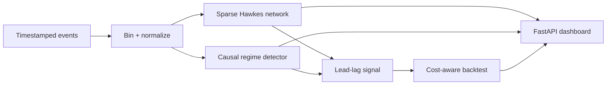

# Market Diffusion Lab

[](https://github.com/AtulBPillai/market-diffusion-lab/actions/workflows/ci.yml)

A deployable quant-research application for studying **how information diffuses across market venues**. It generates a reproducible multi-venue event replay, learns a sparse directed Hawkes-style network, detects market stress, and evaluates lead–lag signals after trading frictions.

> Research question: *During a market shock, which venue absorbs information first, how quickly does it propagate, and does a regime-aware model retain an edge after fees, spread, and slippage?*

## What works now

- Interactive browser dashboard with a directed network, regime timeline, equity curve, top learned relationships, and trade audit trail.
- Reproducible multi-venue market-event simulator with calm, volatile, and dislocated states.
- Sparse exponential-kernel Hawkes approximation fit from timestamped event counts.
- Strict train/test split and causal rolling regime detector.
- Execution-aware out-of-sample backtest with fees, spread, slippage, cooldowns, and drawdown measurement.
- FastAPI JSON API, Docker image, Docker Compose, automated tests, and GitHub Actions CI.

## Architecture



## Run locally

Requirements: Python 3.12+.

```bash
git clone https://github.com/AtulBPillai/market-diffusion-lab.git
cd market-diffusion-lab
python -m venv .venv
source .venv/bin/activate
python -m pip install -r requirements.txt
python -m uvicorn app.main:app --reload --host 0.0.0.0 --port 8000
```

Open [http://localhost:8000](http://localhost:8000). The API reference is available at [http://localhost:8000/docs](http://localhost:8000/docs).

## Run with Docker

```bash
docker compose up --build
```

The container exposes port `8000` and includes a health check at `/api/health`.

## Deploy

This repository is deployable to any container platform. The minimal configuration is:

| Setting | Value |
| --- | --- |
| Build | `docker build -t market-diffusion-lab .` |
| Start command | `uvicorn app.main:app --host 0.0.0.0 --port $PORT` |
| Health check | `/api/health` |
| Exposed port | `8000` locally; respects `PORT` in deployment |

For Render, Railway, Fly.io, Google Cloud Run, or Azure Container Apps, point the service at this repository and select the included `Dockerfile`.

## API

| Endpoint | Purpose |
| --- | --- |
| `GET /api/health` | Container health status |
| `GET /api/metadata` | Replay and model metadata |
| `GET /api/network` | Nodes, directed excitation edges, fit diagnostics |
| `GET /api/regimes` | Causal stress and regime timeline |
| `GET /api/backtest` | Out-of-sample results, equity curve, and trade audit data |
| `GET /api/events` | Normalized-event preview |
| `POST /api/run` | Run a new deterministic replay with `seed`, `duration_seconds`, and `bin_ms` |

Example:

```bash
curl -X POST http://localhost:8000/api/run \
  -H 'Content-Type: application/json' \
  -d '{"seed": 2026, "duration_seconds": 1800, "bin_ms": 1000}'
```

## Project structure

```text
app/
  data.py       event replay and normalized market frame
  hawkes.py     sparse directed diffusion estimator
  regimes.py    causal stress-state detector
  backtest.py   execution-cost-aware test engine
  service.py    thread-safe application orchestration
  main.py       FastAPI application
web/            dependency-free dashboard
tests/          pipeline and API tests
docs/           methodology and research safeguards
```

## Method and safeguards

The built-in replay intentionally has a hidden information leader so the estimator can be evaluated in a controlled setting. The model has no access to the hidden causal graph, latent news shocks, or future prices. It learns only from observed past event counts. See [methodology](docs/methodology.md) for the equations, train/test protocol, and steps required to adapt the pipeline to real timestamped exchange data.

This project is a research and engineering demonstration. It is not a live trading system, investment advice, or evidence that a strategy will be profitable with real-market data.

## Test

```bash
python -m pytest -q
```

## Resume-ready description

> Built a deployable market-information diffusion platform using a sparse Hawkes-style model to infer cross-venue price discovery from high-frequency event replay data; added causal regime detection and an execution-aware out-of-sample backtest accounting for fees, spread, slippage, P&L, and drawdown.

## License

MIT. See [LICENSE](LICENSE).
